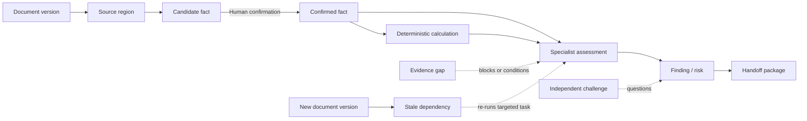
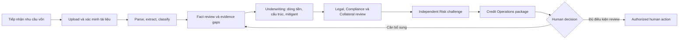
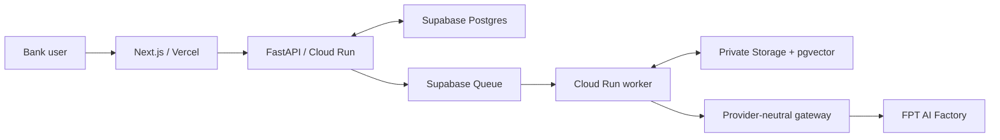

# CreditOps

## AI hỗ trợ chuẩn bị và phản biện hồ sơ tín dụng — con người đưa ra quyết định

CreditOps là workspace cho việc chuẩn bị và rà soát hồ sơ cấp vốn lưu động của doanh nghiệp. Sản phẩm không cố gắng thay thế chuyên viên tín dụng bằng một chatbot trả lời nhanh. Nó tạo ra một **Credit Case Digital Twin**: một hồ sơ số có cấu trúc, có phiên bản, có nguồn gốc bằng chứng và có lịch sử phản biện, để mọi người cùng làm việc trên cùng một sự thật có thể kiểm tra.

Trong thực tế, một hồ sơ vốn lưu động không bắt đầu bằng một dữ liệu sạch. Nó đến từ báo cáo tài chính, sao kê, hợp đồng, hóa đơn, chứng từ pháp lý và nhiều bản bổ sung theo thời gian. Cán bộ quan hệ cần hiểu nhu cầu vốn; underwriter cần dựng dòng tiền và cấu trúc đề xuất; pháp chế và collateral cần kiểm tra điều kiện; risk cần phản biện độc lập; operations cần nhận một package đủ lineage. Khi các hoạt động này chạy qua email, bảng tính và bản tóm tắt rời rạc, dữ kiện dễ bị mất nguồn, phiên bản bị dùng nhầm và kết luận khó được review đến tận căn cứ. CreditOps biến chính ma sát đó thành một workflow có thể nhìn thấy, đo lường và cải tiến.

> **Nguyên tắc cốt lõi:** AI đề xuất, diễn giải và phát hiện thiếu hụt bằng chứng. Deterministic services kiểm soát dữ kiện, tính toán, quyền hạn và chuyển trạng thái. Con người giữ thẩm quyền quyết định tín dụng và mọi hành động tác nghiệp trọng yếu.

## Sản phẩm người dùng thực sự làm việc cùng

Điểm bắt đầu không phải là khung chat mà là một case. Người dùng mở hồ sơ được phân công, nhìn thấy tài liệu đã nhận, phiên bản đang hiệu lực, fact ledger, các giá trị mâu thuẫn, evidence gap, task đang chạy và các phần cần con người xác nhận. Mỗi phát hiện quan trọng đều có thể đi ngược về vùng nguồn trong tài liệu, phép tính hoặc rule đã tạo ra nó. Người review không cần hỏi “con số này từ đâu”; câu trả lời nằm ngay trong case.

Khi tài liệu mới được bổ sung, CreditOps không yêu cầu người dùng làm lại toàn bộ hồ sơ hoặc yêu cầu model viết lại một bản phân tích dài. Hệ thống xác định evidence nào đã thay đổi, output nào phụ thuộc vào evidence đó và phần việc nào cần được chạy lại hoặc review lại. Cách làm này giúp đội ngũ tập trung vào judgment: điều gì đã được chứng minh, điều gì chỉ là assumption, conflict nào còn mở và ai cần xử lý tiếp theo.

## Một Digital Twin có thể phản biện

Credit Case Digital Twin là source of truth của sản phẩm. Nó liên kết document version, source region, candidate fact, confirmed fact, calculation, finding, risk, gap, challenge, handoff và human action thành một EvidenceGraph. Narrative là một artifact để đọc; nó không phải nơi duy nhất giữ tri thức về case.

Đây là khác biệt quan trọng giữa CreditOps và một trợ lý tổng quát. Một nhận định về dòng tiền phải có evidence và phép tính phía sau. Một challenge của risk phải chỉ đúng conclusion, assumption hoặc nguồn cần phản biện. Một evidence gap không chỉ nói “thiếu tài liệu”, mà được biểu diễn với impact, owner, rationale và trạng thái xử lý. Khi bằng chứng thay đổi, dependency giúp hệ thống đánh dấu đúng phần bị stale thay vì để một kết luận lỗi thời tiếp tục xuất hiện như sự thật.

## RAG được thiết kế cho hồ sơ nhạy cảm

RAG trong CreditOps không là tìm kiếm tự do trên toàn bộ kho dữ liệu. Retrieval được giới hạn trước theo case, document version, entity và quyền truy cập; sau đó mới kết hợp structured filters, lexical search và semantic ranking. Một kết quả được đưa cho model phải mang theo document identifier, phiên bản, trang, vùng nguồn và passage để người review quay lại bản gốc.

Graph-guided RAG giảm hai rủi ro thường gặp trong quy trình tín dụng: dùng nhầm thông tin của hồ sơ khác và sử dụng evidence từ phiên bản đã lỗi thời. Retrieval không được phép tự nâng nội dung trích xuất thành fact có thẩm quyền, cũng không thay thế kiểm tra policy. Với policy hoặc checklist, chỉ corpus đã được phê duyệt, có version, effective date, owner và access control mới được đưa vào retrieval; khi không tìm thấy nguồn phù hợp hoặc các nguồn mâu thuẫn, hệ thống phải abstain và tạo đường cho human review.

## AI-native, nhưng không “multi-agent theatre”

CreditOps dùng nhiều vai trò khi mỗi vai trò có trách nhiệm, context, tool, output contract hoặc permission boundary khác nhau. Intake làm rõ nhu cầu và chất lượng tài liệu. Orchestrator quản lý task graph, version và human gate. Underwriting chuẩn bị phân tích dòng tiền, nhu cầu vốn và cấu trúc đề xuất. Legal, Compliance and Collateral kiểm tra chứng cứ liên quan. Independent Risk Review là checker độc lập, không tự kế thừa kết luận của maker. Operations tập hợp package và chuẩn bị proposed action cho người có thẩm quyền.

Các role không được phép tự xóa disagreement, tự đóng gap trọng yếu hoặc tự chuyển một output của model thành quyết định. Material calculations, state transitions, authorization, idempotency, version fence và persistence thuộc deterministic engine. Output không đủ schema, thiếu evidence, có hành vi vượt thẩm quyền hoặc yêu cầu approve, reject, waiver hay disbursement phải bị từ chối hoặc đi vào manual review. Separation of duties vì vậy được hiện diện trong product contract, không chỉ trong sơ đồ kiến trúc.

### Sáu vai trò, sáu hợp đồng thẩm quyền

Sáu agent là vai trò logic ở tầng ứng dụng, không phải sáu model hoặc sáu service phải chạy độc lập. Một endpoint inference đã qua benchmark có thể phục vụ nhiều role; sự chuyên môn hóa đến từ instruction, context, tool, permission và output schema khác nhau.

| Vai trò | Trách nhiệm | Output có thể review | Ranh giới không được vượt qua |
|---|---|---|---|
| Case Orchestrator | Đọc case state, xác định task ready, blocked hoặc stale và route công việc | Task plan, dependency state, escalation | Không tự làm phân tích chuyên môn hoặc quyết định tín dụng |
| Relationship and Intake | Cấu trúc nhu cầu vốn, gắn tài liệu, phát hiện thiếu/trùng/xung đột ban đầu | Structured intake, candidate fact, initial gap | Không bịa dữ kiện hoặc tự gửi yêu cầu khách hàng |
| Credit Underwriting | Chuẩn bị phân tích business, financial, cash flow, working capital và cấu trúc đề xuất | Finding, calculation, risk, mitigant, assumption | Không phê duyệt/từ chối hoặc dùng LLM thay phép tính deterministic |
| Legal, Compliance and Collateral | Rà soát tư cách, thẩm quyền, ownership, controlled check, policy và tài sản | Issue có evidence, citation, possible exception | Không kết luận pháp lý cuối cùng, cáo buộc sai phạm hoặc định giá chỉ bằng LLM |
| Independent Risk Review | Thách thức maker, tìm omission, assumption yếu, mitigant chưa đủ và gap chưa đóng | Challenge, request for evidence/change/manual review | Không vừa là maker vừa tự clearance, không phê duyệt/từ chối |
| Credit Operations | Kiểm tra package, gom provenance và chuẩn bị draft memo/proposed action | Draft case package cho người xem xét | Không thực thi hành động nhạy cảm khi chưa có authorization |

Không role nào được mở rộng quyền qua Orchestrator, và rerun không được làm gap hoặc challenge biến mất khỏi audit history. Điều này buộc sản phẩm ghi nhận disagreement như một phần của case, thay vì để agent có câu trả lời “mượt hơn” thắng agent khác.

### Evidence Gap Resolution: thiếu sót cũng là một artifact

Evidence Gap Resolution không là một chatbot phụ. Đây là capability dùng chung để biến evidence thiếu, mâu thuẫn, stale, khó đọc, low-confidence hoặc chưa đủ hỗ trợ cho kết luận thành workflow state có owner và lịch sử. Một gap tốt cho biết evidence hiện có và vùng nguồn, thông tin cần làm rõ, lý do, task/finding/calculation/memo section bị ảnh hưởng, mức độ `BLOCKING`, `CONDITIONAL` hoặc `CLARIFICATION`, tài liệu tối thiểu được gợi ý, approval status và resolution evidence.

Các mức trên là ngôn ngữ vận hành của sản phẩm, không phải phân loại chính thức của SHB. Gap không phải bằng chứng gian lận hoặc vi phạm. AI có thể đề xuất tài liệu và rationale, nhưng nhân sự có thẩm quyền phải duyệt trước khi yêu cầu được gửi cho khách hàng.

### AI diễn giải; hệ thống xác định và con người quyết định

| Phù hợp cho AI có giới hạn | Phải thuộc deterministic tool/service hoặc con người |
|---|---|
| Diễn giải ngữ cảnh tài liệu, chuẩn bị analysis có citation, phát hiện candidate conflict/gap | Phép tính, reconciliation, threshold, authorization, role/case access và state transition |
| Giải thích uncertainty, alternative interpretation, challenge và draft cho reviewer | Controlled KYC/AML/watchlist/CIC/collateral lookup, database write, idempotency, immutable version và audit event |
| Gợi ý bước tiếp theo | Credit decision, exception disposition, customer communication approval, signing, disbursement và mutation hệ thống nhạy cảm |

FPT chỉ thực hiện inference. Model response không trở thành case truth, quyền hạn, tool execution hay approval record; gateway kiểm tra schema, giới hạn payload và từ chối trường quyết định bị cấm trước khi output được dùng trong workflow.

## EvidenceGraph: mỗi kết luận đều có đường về nguồn

Graph này là cơ chế để case giữ được ngữ cảnh khi nhiều người và nhiều AI role cùng tham gia. Tài liệu không đi thẳng thành kết luận; nó được chia thành vùng nguồn, sinh candidate fact, được xác nhận khi cần và mới đi vào phép tính hay assessment. Gap và challenge không bị giấu trong comment: chúng tồn tại như node có quan hệ với conclusion bị ảnh hưởng. Khi một document version mới đến, dependency graph chỉ ra artifact nào cần cập nhật, giữ audit trail nhất quán và tránh rerun toàn bộ case.

## Workflow: từ tài liệu đến quyết định của con người

Workflow không giả định đường đi thẳng. Một conflict có thể đưa case về bước review facts; một gap có thể mở task cho đúng owner; một risk challenge giữ assessment ở trạng thái chưa đóng cho đến khi maker phản hồi và người có thẩm quyền ghi nhận disposition. Điều này biến sự phối hợp đa vai trò thành một quy trình có checkpoint, handoff và accountability thay vì chuỗi tin nhắn giữa các agent.

## Kiến trúc phục vụ khả năng mở rộng

CreditOps tách trải nghiệm người dùng, workflow authority, durable state và inference thành các ranh giới độc lập. Frontend tiếng Việt chạy trên Vercel. FastAPI trên Cloud Run giữ logic nghiệp vụ, human gates và orchestration; worker xử lý tài liệu bất đồng bộ. Supabase giữ Postgres, Queue, private Storage, retrieval metadata và pgvector. FPT AI Factory chỉ thực hiện inference qua provider-neutral gateway.

Tách lớp như vậy giúp API và worker scale độc lập theo lượng case, tài liệu và tác vụ inference. Browser không cầm service-role secret hoặc điều phối workflow. Upload đi qua backend-created intent, rồi được xác minh trước khi thành document version. Queue chỉ vận chuyển identifier; lease, checkpoint, retry, redelivery, idempotency và stale-version protection giúp xử lý lại an toàn khi worker lỗi hoặc tài liệu được cập nhật. Model, embedding hoặc reranker có thể được thay sau benchmark mà không đổi source of truth hay business contract.

Đây là hướng triển khai thực tế cho ngân hàng: bắt đầu bằng evidence-and-control layer nằm giữa document AI và workflow tín dụng có thẩm quyền, sau đó mở rộng theo giai đoạn thay vì thay thế LOS, core banking hoặc professional judgment. Giá trị cần được chứng minh qua turnaround time, số vòng bổ sung, citation accuracy, gap recall, chất lượng phản biện, chi phí mỗi case và số rerun không cần thiết — không phải một con số ROI tự tuyên bố.

## Công nghệ đội sử dụng

| Lớp | Công nghệ | Vai trò trong CreditOps |
|---|---|---|
| Product UI | Next.js, React, TypeScript, Vercel | Giao diện tiếng Việt cho case, evidence, task, review và handoff; frontend chỉ gọi backend, không nắm đặc quyền. |
| Application authority | Python, FastAPI, Pydantic, Cloud Run | Xác thực contract, kiểm tra quyền, orchestration, human gate và deterministic business logic. |
| Durable state | Supabase PostgreSQL | Lưu Credit Case Digital Twin, EvidenceGraph, workflow state, audit record, permission metadata và version history. |
| Asynchronous processing | Supabase Queues, Cloud Run worker | Điều phối xử lý tài liệu bằng identifier, lease, checkpoint, retry, redelivery và idempotency. |
| File và retrieval | Supabase Storage, pgvector, full-text search | Lưu immutable document/derived artifact; truy xuất evidence có scope theo case, version và quyền truy cập. |
| AI capability | FPT AI Factory qua provider-neutral gateway | Reasoning, document extraction, vision, embedding và reranking được chọn theo benchmark; model không sở hữu state hay quyền thao tác. |
| Delivery controls | Docker, Terraform, GitHub Actions | Đóng gói, migration, triển khai theo hạ tầng khai báo và kiểm tra pipeline có thể tái tạo. |

Sơ đồ công nghệ thể hiện một nguyên tắc vận hành: state, quyền hạn và audit nằm ngoài model. AI có thể thay đổi theo benchmark, nhưng case state, evidence lineage, authorization và human decision không thay đổi theo một model hay provider cụ thể. Điều đó tạo nền cho việc scale theo tải xử lý, thay thế capability khi có số liệu tốt hơn và mở rộng workflow mà không làm mất kiểm soát.

## Banking-service specifications đã được mã hóa

Các spec dưới đây là contract đã được thể hiện bằng domain model, API boundary, migration hoặc test trong repository. Chúng mô tả các control cần cho một workflow tín dụng có thể kiểm tra; không phải tuyên bố rằng môi trường managed đã trở thành hệ thống ngân hàng production.

| Spec triển khai | Hành vi bắt buộc | Ý nghĩa đối với dịch vụ ngân hàng | Artifact kỹ thuật |
|---|---|---|---|
| **Case-scoped và assigned-officer access** | Mọi read/write material phải gắn case scope và kiểm tra cán bộ được phân công. | Hạn chế truy cập chéo hồ sơ và bảo vệ phân tách trách nhiệm ngay từ lớp API. | `cases`, `assignments`, API authorization, RLS migration và assigned-officer tests. |
| **Private upload intent & completion verification** | Browser chỉ upload bằng intent ngắn hạn; backend đối chiếu intent, object key, size, content type và checksum trước khi đăng ký document version. | Không để “upload thành công ở browser” trở thành tài liệu có thẩm quyền; chống đăng ký nhầm object hoặc upload vượt scope. | Upload-intent use cases, Storage adapter, RLS và security tests. |
| **Immutable document version & provenance** | Original/derived artifact được version hóa; source region, fact, calculation, finding và review giữ liên kết provenance. | Reviewer luôn biết kết luận dùng đúng tài liệu và phiên bản nào; có thể audit và xử lý supersession. | Document/evidence/edge schema, version references và EvidenceGraph migrations. |
| **Explicit task state machine** | Task có type, idempotency key, input version, stage, attempt, terminal reason và allowed transition. | Workflow không phụ thuộc memory của model hoặc một request HTTP; trạng thái có thể kiểm tra và khôi phục. | Task domain, transition tests, queue/checkpoint migrations. |
| **Lease, checkpoint, retry & redelivery** | Queue message chỉ mang opaque identifier; worker claim lease, checkpoint durable output, chỉ acknowledge sau success và không ghi vào version đã stale. | Chống duplicate effect, mất tiến độ và ghi đè hồ sơ mới khi có retry, crash hoặc document update. | Queue contract, worker-resume integration test, retry/redelivery tests. |
| **Maker–checker và human gate** | Underwriting tạo analysis; Independent Risk Review tạo challenge độc lập; material disposition/action phải qua human gate. | Không cho cùng một AI role tự lập luận và tự clearance; giữ accountable decision cuối cùng ở con người. | Orchestration graph/gate, risk-review schema, disposition và authorization contracts. |
| **Deterministic calculation boundary** | Calculation, reconciliation, threshold, authorization và state transition chạy bằng deterministic code; AI chỉ tạo analysis có evidence. | Loại bỏ việc dùng LLM làm calculator hoặc policy engine không thể tái tạo. | Underwriting calculators, transition rules và schema validation tests. |
| **Policy và RAG có scope** | Retrieval lọc theo authorization, case/version/entity hoặc corpus policy đã versioned; citation phải trở về source location; không có hit phải abstain. | Giảm cross-case leakage, stale evidence và câu trả lời policy không căn cứ. | pgvector/retrieval metadata schema, synthetic corpus checksum và citation contracts. |
| **Model gateway fail-closed** | FPT response phải qua JSON Schema, payload bounds và forbidden-field checks; endpoint/model/prompt/schema/route/correlation metadata được trả về. | Model không thể tự ghi case truth, tăng quyền tool hoặc sinh approval record; lỗi provider không tạo public fallback âm thầm. | Provider-neutral FPT gateway, contract tests và typed failure path. |
| **Append-only audit và observability** | Material event ghi actor, case/version, request/execution correlation, timestamp và provenance; log được redaction. | Tạo trace cho review, investigation và vận hành mà không làm lộ dữ liệu nhạy cảm không cần thiết. | Audit contracts, observability/log-redaction tests và versioned records. |
| **BFF và secret boundary** | Frontend chỉ gọi BFF/API theo allowlist; privileged credentials và inference secret không đi vào browser bundle. | Hạn chế lộ service role, ngăn UI hoặc prompt trở thành đường bypass authorization. | Next.js BFF contracts, secret-config, CSRF và security tests. |

Các spec này phối hợp thành một nguyên tắc đơn giản: không có model output nào tự trở thành sự thật, không có background task nào tự tạo effect không thể truy vết, và không có human decision nào bị suy diễn từ text của model. Đó là cách CreditOps chuyển yêu cầu “AI hỗ trợ ngân hàng” thành các ràng buộc có thể kiểm tra bằng mã nguồn.

## Cách CreditOps tạo bằng chứng cho bài thi

README này trình bày sản phẩm để giám khảo hiểu nó giải quyết công việc nào và vì sao kiến trúc phù hợp. Phần còn lại của repository cung cấp bằng chứng kỹ thuật để hệ thống AI đánh giá code structure, deployment path, AI-native architecture, documentation và product completeness. Cùng lúc đó, product narrative ở trên cho phép Hội đồng chuyên gia đánh giá trải nghiệm thực tế, mức độ giải quyết đúng bài toán, tính khả thi triển khai, khả năng mở rộng và tiềm năng giá trị kinh doanh.

Không một model hay một góc nhìn đơn lẻ quyết định giá trị của CreditOps. Sản phẩm được thiết kế để các kết luận quan trọng cũng vận hành theo nguyên tắc tương tự: có nguồn, có người chịu trách nhiệm, có phản biện độc lập và có human decision cuối cùng.

## Bản đồ tài liệu

- [Project context](docs/PROJECT_CONTEXT.md) — phạm vi, đối tượng người dùng và use case.
- [Banking workflow](docs/BANKING_WORKFLOW.md) — luồng chuẩn bị và review hồ sơ.
- [Domain model](docs/DOMAIN_MODEL.md) — Credit Case Digital Twin và EvidenceGraph.
- [Agent architecture](docs/AGENT_ARCHITECTURE.md) — vai trò, quyền hạn và separation of duties.
- [Evidence Gap Resolution](docs/EVIDENCE_GAP_RESOLUTION.md) — cách gap trở thành shared workflow state.
- [Technical direction](docs/TECHNICAL_DIRECTION.md) — ranh giới Vercel, Cloud Run, Supabase và FPT.
- [Product boundaries](docs/PRODUCT_BOUNDARIES.md) — những việc AI không được phép làm.
- [Open questions](docs/OPEN_QUESTIONS.md) — những quy tắc nghiệp vụ và điều kiện chưa được phép giả định.
- [Decision log](docs/DECISION_LOG.md) — các quyết định kiến trúc và lịch sử thay đổi.

## Ranh giới dữ liệu và thẩm quyền

> All customer data, policies, documents, and banking-system responses in this project are synthetic and created solely for demonstration.

Nội dung synthetic không phải chính sách chính thức của SHB. CreditOps không tự phê duyệt hoặc từ chối tín dụng, miễn policy, kết luận pháp lý, ký kết, giải ngân hay sửa hệ thống nhạy cảm. Mọi kết luận trọng yếu cần evidence và provenance; uncertainty, conflict và evidence gap phải được hiển thị thay vì bị che giấu.
