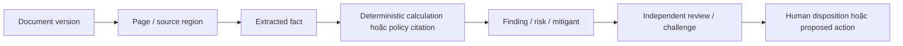
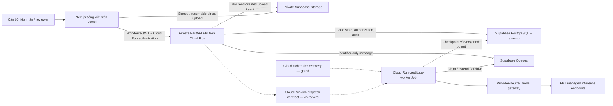

# SHB CreditOps EvidenceGraph

## AI hỗ trợ chuẩn bị và phản biện hồ sơ — con người đưa ra quyết định

**SHB CreditOps EvidenceGraph** là dự án evidence-first cho bài toán chuẩn bị và rà soát hồ sơ cấp vốn lưu động của doanh nghiệp SME. Hệ thống tổ chức hồ sơ thành một **Credit Case Digital Twin** có cấu trúc, phiên bản và chuỗi nguồn gốc: tài liệu nào tạo ra dữ kiện nào, phép tính nào sử dụng dữ kiện đó, kết luận nào dựa trên bằng chứng nào và ai đã rà soát kết luận ấy. Repository hiện có các lát cắt triển khai cục bộ cho toàn bộ sáu vai trò logic, từ intake, orchestration và specialist analysis đến independent review và credit-operations package; đây vẫn chưa phải một runtime cloud end-to-end.

Mục tiêu của dự án không phải tự động hóa quyết định tín dụng. AI được đặt đúng vai trò: hỗ trợ tiếp nhận, cấu trúc hóa, phân tích, phát hiện khoảng trống bằng chứng và chuẩn bị nội dung để chuyên gia phản biện. Mọi quyết định trọng yếu, xử lý ngoại lệ và hành động tác nghiệp vẫn thuộc thẩm quyền của con người.

> **Ranh giới dữ liệu bắt buộc**
>
> All customer data, policies, documents, and banking-system responses in this project are synthetic and created solely for demonstration.

Nội dung synthetic trong repository không phải chính sách chính thức của SHB. Dự án chưa được triển khai như một hệ thống ngân hàng, chưa tuyên bố production-ready, chưa chứng minh tuân thủ quy định và không đại diện cho sự phê duyệt hoặc bảo chứng của SHB.

## Trạng thái hiện tại

Tại snapshot cục bộ ngày **2026-07-18**, repository chứa các **implementation slice được kiểm chứng bằng unit, integration, contract, security, component tests và build** cho sáu vai trò logic: Relationship/Intake; Case Orchestrator; Credit Underwriting; Legal, Compliance and Collateral; Independent Risk Review; và Credit Operations. Phạm vi đã có gồm giao diện tiếng Việt cho intake và review, API/repository/migration cho artifact chuyên môn, task graph và human gate deterministic, maker–checker contracts, package/action authorization, pipeline tài liệu có giới hạn, adapter FPT theo capability và deployment contracts.

> **RELEASE STATUS — DEPLOYMENT IN PROGRESS**
>
> Nhóm đang chạy cấu hình và kiểm chứng hệ thống managed, dự kiến hoàn tất trong tối **2026-07-18**. README phân biệt phần đã pass trong repository với phần runtime đang đóng gate; URL, smoke-test output và deployment evidence chỉ được xem là hoàn tất khi pipeline đang chạy trả kết quả thành công.

Ở cấp source/test, hành trình sáu vai trò đã được hiện thực hóa bằng các bounded slices. Ở cấp runtime, production worker composition, review contracts và Supabase/Cloud Run/Vercel/FPT integration đang được hoàn tất trong release run hiện tại. Model/policy quality trên bộ hồ sơ đại diện vẫn là evaluation track riêng, không bị suy diễn từ việc deploy thành công.

| Lớp trạng thái | Ý nghĩa trong README | Trạng thái hiện tại |
|---|---|---|
| **Đã có trong repository** | Có mã nguồn, migration, cấu hình hoặc test có thể kiểm tra trực tiếp | Intake/upload; deterministic orchestration; bốn specialist slices; maker–checker và human authorization; review UI; FPT gateway contract; CI/CD và Infrastructure as Code |
| **Đã kiểm chứng cục bộ** | Có lệnh tái tạo vừa chạy thành công trên trạng thái repository hiện tại | 446 backend tests; 183 frontend tests; Ruff; mypy strict; TypeScript; ESLint; Next.js production build |
| **Đang hoàn tất runtime** | Release pipeline hoặc integration verification đang chạy | Supabase migration/runtime, private Cloud Run API, worker composition, Vercel deployment, FPT smoke và synthetic six-role trace; mục tiêu đóng gate trong tối 2026-07-18 |
| **Kiến trúc mục tiêu đã xác nhận** | Hướng triển khai đã được quyết định nhưng không hàm ý dịch vụ đang live | Vercel → Cloud Run → Supabase → FPT managed inference |
| **Đề xuất / benchmark-gated** | Chỉ được chọn sau khi có endpoint, dữ liệu và kết quả đánh giá phù hợp | Model suy luận, KIE, table, vision, embedding, reranker và ngưỡng chất lượng cuối cùng |
| **Phụ thuộc nguồn chính thức / đánh giá sau release** | Không thể tự suy ra từ code hoặc deployment | Policy corpus/checklist chính thức của SHB, benchmark nghiệp vụ, usability study và business KPI |

### Điều hướng nhanh

- [Mức độ phù hợp với tiêu chí đánh giá](#vì-sao-dự-án-phù-hợp-với-tiêu-chí-đánh-giá)
- [Góc nhìn của Hội đồng chuyên gia](#góc-nhìn-của-hội-đồng-chuyên-gia)
- [Những gì đã có trong repository](#những-gì-đã-có-trong-repository)
- [Credit Case Digital Twin](#mô-hình-miền-mục-tiêu-của-credit-case-digital-twin)
- [Kiến trúc multi-agent](#kiến-trúc-multi-agent-có-giới-hạn-thẩm-quyền)
- [Kiến trúc cloud mục tiêu](#kiến-trúc-ứng-dụng-và-cloud-mục-tiêu)
- [Security và responsible AI](#security-governance-và-responsible-ai)
- [Quickstart](#quickstart) · [Kiểm chứng](#kiểm-chứng)
- [Roadmap](#mức-độ-hoàn-thiện-và-roadmap) · [Bản đồ tài liệu](#bản-đồ-tài-liệu)

## Vì sao dự án phù hợp với tiêu chí đánh giá

README này được tổ chức để cả hệ thống đánh giá tự động lẫn Hội đồng chuyên gia có thể kiểm tra cùng một luận điểm từ hai phía: **giá trị sản phẩm** và **bằng chứng kỹ thuật**.

| Tiêu chí | Bằng chứng trong repository | Điểm mạnh tạo ra | Cách đọc đúng trạng thái |
|---|---|---|---|
| **Chất lượng và cấu trúc mã nguồn** | Next.js/TypeScript tách route, component, BFF và contract; FastAPI/Python tách domain, application, ports, infrastructure và API; migrations tuần tự; test theo unit, integration, contract và security | Logic nghiệp vụ không bị trộn vào prompt; ranh giới phụ thuộc rõ; dễ kiểm thử từng failure mode | Đã kiểm chứng cục bộ, nhưng chưa gọi là production-grade hoặc có coverage mục tiêu |
| **Tình trạng deployment** | Terraform cho Cloud Run/IAM/secrets/scheduler/monitoring; GitHub Actions cho migration, immutable image, private Cloud Run và Vercel; runbook và smoke scripts | Deployment path cụ thể, fail-closed và có rollback thay vì chỉ có sơ đồ ý tưởng | Release run đang thực thi; live URL và smoke evidence là gate hoàn tất cuối |
| **Kiến trúc và mức độ AI-native** | Credit Case Digital Twin, EvidenceGraph, validated planner proposal, deterministic task graph/gates, role-specific structured outputs, provider-neutral gateway, maker–checker và authorization records | AI đề xuất và diễn giải trong phạm vi từng vai trò; hệ thống deterministic giữ sự thật, quyền hạn, phép tính và state | Sáu role slices có code/test; production worker, live inference và E2E đang được đóng trong release run |
| **README và tài liệu kỹ thuật** | Context, workflow, architecture, domain, boundaries, open questions, decision log, runbook và secrets guide được tách riêng, có status labels | Giám khảo phân biệt được điều đã làm, điều dự kiến và điều chưa biết; quyết định bị superseded vẫn có lịch sử | Trạng thái implementation đã được đồng bộ theo code-verifiable snapshot; full workflow và managed deployment vẫn được giữ là target/open gate |
| **Mức độ hoàn thiện sản phẩm** | UI intake/review tiếng Việt, API và persistence contracts cho sáu vai trò, private upload, durable workflow, specialist processors, model gateway, CI/CD và IaC | Có implementation artifacts xuyên suốt intake → analysis → challenge → package ở cấp local contract | Chưa phải demonstrator end-to-end trên managed services; một số frontend/backend review contracts còn chờ chuẩn hóa |

### 1. Chất lượng mã nguồn được thể hiện bằng ranh giới có thể kiểm thử

Backend không để model tự nắm workflow. Các thực thể và quy tắc chuyển trạng thái nằm trong `domain`; use case điều phối ở `application`; PostgreSQL, Supabase, FPT và GCP được đặt sau các port/adapter; HTTP API chỉ làm validation, authentication, authorization và chuyển đổi contract. Cách chia này giúp thay model hoặc provider mà không phải viết lại thẩm quyền nghiệp vụ.

Frontend cũng không gọi trực tiếp model hoặc giữ service-role credential. Giao diện gọi một BFF có route allowlist, kiểm tra JSON theo contract, giới hạn request/response, chống CSRF cho mutation và tách workforce token khỏi Cloud Run serverless authorization. Trong lát cắt hiện tại, nội dung do AI sinh không thể tự dùng BFF để mở rộng quyền: mutation vẫn phải qua allowlist, CSRF và backend authorization. Full agent/action/human-gate runtime chưa được wire end-to-end.

Chất lượng không chỉ được mô tả bằng tên thư mục. Snapshot kiểm chứng trên working tree ngày **2026-07-18** cho thấy backend tests, frontend tests, static checks và production build đều chạy thành công; các lệnh tái tạo nằm trong phần [Kiểm chứng](#kiểm-chứng). Đây là quan sát cục bộ, chưa phải CI artifact hoặc release evidence.

### 2. Deployment được đánh giá bằng khả năng triển khai và bằng chứng live riêng biệt

Repository có source cho deployment workflow: migration được đặt trước application, container được build và tham chiếu bằng digest bất biến, Cloud Run API được cấu hình không mở public, GitHub dùng OIDC thay cho service-account key dài hạn, frontend được build trước khi deploy và worker chỉ được cập nhật khi readiness gate cho phép.

Điểm quan trọng là dự án không dùng sự tồn tại của Terraform hoặc GitHub Actions để suy ra “đã triển khai”. Release run đang thực thi và chỉ chuyển sang trạng thái hoàn tất sau authenticated health/readiness, migration, worker, frontend và FPT smoke checks. Cách tách deployability khỏi deployment evidence giúp giám khảo nhìn thấy cả độ nghiêm túc kỹ thuật lẫn tính trung thực của submission.

### 3. AI-native nằm ở mô hình vận hành, không nằm ở số lượng agent

Hệ thống không được thiết kế như sáu chatbot cùng nói về một hồ sơ. Mỗi vai trò logic có duty, input, tool, schema, quyền và forbidden action riêng. Bounded local slices đã hiện thực hóa planner proposal có validation, task graph/gate deterministic, specialist output schema, version-bound persistence, maker–checker challenge và human disposition/action-authorization records. Model output vẫn chỉ là artifact chưa có thẩm quyền; chưa có production worker wiring và managed-inference run để chứng minh toàn chuỗi end-to-end.

Điểm AI-native cốt lõi là khả năng đưa uncertainty, conflict, evidence gap, challenge và abstention thành state có cấu trúc. Khi bằng chứng đổi, hệ thống hướng tới việc đánh dấu downstream output bị stale và chỉ chạy lại phần phụ thuộc, thay vì hỏi model viết lại toàn bộ hồ sơ từ đầu.

### 4. Tài liệu là một phần của kiến trúc kiểm chứng

Các tài liệu không gom mọi thứ vào một bản mô tả marketing. [Project Context](docs/PROJECT_CONTEXT.md) giải thích identity và scope; [Agent Architecture](docs/AGENT_ARCHITECTURE.md) mô tả vai trò và ranh giới thẩm quyền; các [ADR](docs/adr/) ghi quyết định orchestration/policy-corpus; [Decision Log](docs/DECISION_LOG.md) giữ quyết định hiện hành lẫn quyết định đã superseded; và [Open Questions](docs/OPEN_QUESTIONS.md) giữ những phần chưa được phép biến thành banking rule.

Kỷ luật `CONFIRMED / PROPOSED / ASSUMPTION / OPEN QUESTION / OUT OF SCOPE` giúp giảm một lỗi phổ biến của sản phẩm AI: biến điều “model có thể làm” thành điều “hệ thống đã làm và được phép làm”.

### 5. Độ hoàn thiện được trình bày như một maturity ladder

Walking skeleton đã mã hóa guard, contract và test cho authority boundary, versioned data, upload verification, idempotency, queue redelivery, checkpoint, schema validation, prompt-injection boundary, deterministic calculations, task-graph/human-gate enforcement, maker–checker separation, deployment identity contract và fail-closed worker. Provider behavior và deployment identity vẫn chưa được live-verified.

Các bounded processors và artifact contracts cho underwriting, legal/compliance/collateral, independent risk, synthetic policy retrieval và credit-operations package đã có code/test. README không đánh đồng chúng với một tính năng đã vận hành: official-policy RAG, production worker wiring, live FPT inference, managed-service E2E và model benchmarking vẫn chưa có bằng chứng runtime.

## Góc nhìn của Hội đồng chuyên gia

### Trải nghiệm thực tế của người dùng

Giao diện hiện có ưu tiên luồng làm việc theo hồ sơ: tiếng Việt, thông báo synthetic luôn hiển thị, danh sách hồ sơ theo phân công, form tạo hồ sơ, tiếp nhận tài liệu, fact ledger, source-region review, conflict, evidence gap, handoff và audit timeline. Người dùng không phải trao đổi với một chatbot để “nhớ” hồ sơ; họ thao tác trên case và artifact có trạng thái rõ ràng.

Các review views đã có component/schema tests nhưng một số endpoint và page-preview contract vẫn được ghi rõ là contract-pending; vì vậy chúng chưa cấu thành một trải nghiệm end-to-end. Dự án chưa có usability study hoặc số liệu tiết kiệm thời gian, nên README chỉ nêu giá trị thiết kế chứ không phát minh hiệu quả đã đo.

### Chất lượng và tính hoàn thiện của sản phẩm

Chất lượng sản phẩm được đặt ở khả năng thất bại an toàn. Upload không được đăng ký chỉ vì browser báo thành công; backend phải đối chiếu intent, object key, size, content type và checksum rồi mới tạo document version và task. Processor classes và registry seam đã có, nhưng bare worker entrypoint vẫn thoát với mã `78` khi production dependencies chưa được inject, thay vì báo một lượt xử lý giả thành công. Model response sai schema hoặc chứa trường quyết định bị cấm sẽ bị từ chối.

Các cơ chế này là bằng chứng về robustness ở cấp contract, chưa chứng minh một trải nghiệm end-to-end. Giao diện review đã biểu diễn source overlay, conflict, gap, handoff và audit; chất lượng thực tế vẫn cần được kiểm tra bằng các câu hỏi chuyên gia: có mở được đúng nguồn của một finding không, challenge có trỏ đúng artifact không và unresolved item có luôn nổi bật không.

### Khả năng giải quyết đúng bài toán

Phạm vi ban đầu tập trung vào stages 2–6 của luồng tín dụng doanh nghiệp ở mức khái niệm: hiểu nhu cầu vốn, thu thập và kiểm tra hồ sơ, chuẩn bị phân tích, đề xuất cấu trúc, hỗ trợ phản biện độc lập và đưa case package cho con người xem xét. Đây không phải process map chính thức của SHB.

Thiết kế giải quyết đúng điểm nghẽn thông tin: hồ sơ phân mảnh, dữ kiện mâu thuẫn, nguồn không rõ, giả định bị lẫn với fact và vòng bổ sung tài liệu khó theo dõi. Hệ thống không giải bài toán bằng cách dự đoán “duyệt hay không duyệt”; nó làm cho hồ sơ và lập luận trở nên dễ kiểm chứng hơn để chuyên gia quyết định tốt hơn.

### Tính khả thi khi triển khai

Kiến trúc mục tiêu dùng managed services theo trách nhiệm rõ ràng: Vercel cho trải nghiệm web, Cloud Run cho API/orchestration/worker, Supabase cho durable state/queue/storage/retrieval và FPT cho inference. API và worker scale độc lập; document body không đi qua Vercel Function; queue chỉ mang identifier; state không nằm trong memory của model.

Tính khả thi vẫn phụ thuộc các cổng chưa đóng: region và data residency được phép, private connectivity, identity provider, backup/restore, FPT endpoint capability, quota, latency, retention, benchmark tiếng Việt và production-data authorization. Các cổng này được giữ trong [Open Questions](docs/OPEN_QUESTIONS.md), không bị biến thành giả định ngầm.

### Tiềm năng phát triển và giá trị kinh doanh

Giá trị dự kiến nằm ở việc giảm công sức tổng hợp lặp lại, giúp yêu cầu bổ sung tài liệu có lý do, rút ngắn vòng tìm nguồn, cho phép reviewer tập trung vào gap/risk/exception có ảnh hưởng và giữ lịch sử phản biện không bị mất khi hồ sơ thay đổi.

Trong kiến trúc mục tiêu, Credit Case Digital Twin tạo một lớp tích hợp có cấu trúc cho các hệ thống hiện hữu: case state, evidence lineage và approval artifact có thể được trao đổi qua contract thay vì qua narrative tự do. Dự án chưa có business KPI hoặc ROI đã đo; mọi tuyên bố giá trị ở đây là hypothesis cần được kiểm chứng bằng synthetic scenario, user test và benchmark.

| Value hypothesis | Proxy metric không cần dữ liệu thật | Cách đo trên synthetic case |
|---|---|---|
| Giảm thời gian tìm nguồn | Median time từ finding tới đúng document/page | Cho reviewer xử lý cùng case với và không có provenance link |
| Giảm kết luận thiếu căn cứ | Tỷ lệ material finding có citation hợp lệ; số uncited finding | So với ground-truth evidence map và single-agent baseline |
| Giảm rerun không cần thiết | Số task chạy lại sau một document change | Đổi một fact có dependency đã biết và quan sát invalidation scope |
| Tăng chất lượng phản biện | Gap recall, reviewer correction rate, unresolved-challenge visibility | Dùng case có contradiction/omission được gắn nhãn trước |
| Hạn chế thu thập quá mức | Số requested document không cần thiết | So suggested request với minimal ground-truth resolution set |

Các metric này chưa có kết quả; bảng mô tả cách biến giá trị kinh doanh thành phép đo có thể kiểm chứng thay vì ROI tự khai báo.

## Bài toán và câu trả lời của sản phẩm

Một hồ sơ vốn lưu động SME có thể bao gồm đăng ký doanh nghiệp, hồ sơ người đại diện, đề nghị cấp tín dụng, hợp đồng mua bán, hóa đơn, báo cáo tài chính, sao kê, lịch trả nợ và tài liệu tài sản bảo đảm. Mỗi tài liệu có thể có nhiều phiên bản, chất lượng scan khác nhau, dữ kiện lặp hoặc mâu thuẫn và giá trị chỉ đúng trong một khoảng thời gian.

Nếu chỉ đưa toàn bộ tài liệu vào một chat context, ba vấn đề xuất hiện:

1. câu trả lời trôi theo hội thoại và khó xác định source of truth;
2. model có thể trộn fact, assumption, calculation và recommendation; và
3. reviewer khó biết thay đổi tài liệu nào đã làm kết luận nào trở nên stale.

CreditOps chuyển trọng tâm từ “AI trả lời gì?” sang “artifact nào đang ở trạng thái nào, dựa trên bằng chứng nào và cần ai xử lý tiếp?”. Repository đã có bounded local artifacts cho từng chặng dưới đây; production-wired end-to-end execution vẫn là mục tiêu chưa được chứng minh.

```text
Tài liệu khách hàng phân mảnh
  → phiên bản tài liệu bất biến
  → dữ kiện có vị trí nguồn và độ tin cậy
  → phép tính deterministic và phân tích chuyên môn
  → conflict, risk và evidence gap có cấu trúc
  → yêu cầu bổ sung phải được con người duyệt
  → independent risk challenge
  → draft case package cho người có thẩm quyền xem xét
```

## Những gì đã có trong repository

| Năng lực | Bằng chứng | Trạng thái kiểm chứng | Giới hạn hiện tại |
|---|---|---|---|
| Giao diện case/intake tiếng Việt | [`apps/web/app`](apps/web/app), [`components/cases`](apps/web/components/cases), [`components/uploads`](apps/web/components/uploads) | Component tests, typecheck, lint và build pass | Chưa có usability study hoặc live identity/backend journey |
| Review workspace có provenance | [`components/review`](apps/web/components/review), [`components/evidence`](apps/web/components/evidence), [`components/gaps`](apps/web/components/gaps), [`components/handoff`](apps/web/components/handoff), [`components/audit`](apps/web/components/audit) | 42 focused component tests cùng schema/BFF tests pass | Gap/handoff/audit còn là contract-pending shell; page-image và một số wire contract chưa có canonical API |
| BFF có route allowlist và input boundary | [`creditops-bff.ts`](apps/web/lib/server/creditops-bff.ts) | Contract tests pass | Phát hành workforce session cookie từ IdP chưa được live-verified |
| Private Cloud Run authentication contract | [`cloud-run-auth.ts`](apps/web/lib/server/cloud-run-auth.ts) | Unit tests pass | Vercel OIDC → GCP WIF chưa được thử trên môi trường thật |
| Case-scoped/assigned-officer API | [`cases.py`](services/api/src/creditops/api/cases.py), application use cases và repositories | Backend unit/API tests pass | Cần IdP và Supabase thật để xác minh end-to-end |
| Backend-created upload intent | [`create_upload_intent.py`](services/api/src/creditops/application/use_cases/create_upload_intent.py), [Supabase Storage adapter](services/api/src/creditops/infrastructure/supabase/storage.py) và [migration `010`](supabase/migrations/202607170010_upload_intents_completion.sql) | Validation/security/contract tests pass | Chưa gọi Storage endpoint thật |
| Xác minh hoàn tất upload | Metadata, size, content type, streamed SHA-256, immutable copy, duplicate detection và idempotency lease | Backend tests pass | Reconciliation sau provider/database partial failure chưa được vận hành thật |
| Durable task và checkpoint contracts | Domain task state, queue envelope, worker lease, retry/redelivery và integration test | Unit/integration/contract tests pass | Worker runtime thật vẫn bị readiness gate chặn |
| Bounded document pipeline | Security, parse, classify, extract và index stage contracts; PDF/DOCX/XLSX text parsers và image metadata placeholder | Processing-stage tests pass | Managed OCR/KIE/table/vision chưa benchmark hoặc live-configure |
| FPT capability gateway | [Provider-neutral port](services/api/src/creditops/application/ports/model_gateway.py), [FPT gateway](services/api/src/creditops/infrastructure/fpt/gateway.py), structured-output schema validation, bounded response và metadata contract | Contract tests pass với test transport | Exact FPT endpoints, quota và model cuối cùng chưa xác nhận |
| Case Orchestrator | [Deterministic graph/gates](services/api/src/creditops/application/orchestration), validated LLM planner proposal, orchestration API/repository và worker processor | API/unit tests kiểm tra dependency, gap, stale-version, gate, idempotency, audit và dispatch | Production worker registry và live FPT/Supabase run chưa wire |
| Credit Underwriting | [Maker và calculators](services/api/src/creditops/application/underwriting), typed assessment, evidence binding, processor, API và PostgreSQL adapter | API/unit tests kiểm tra phép tính, schema, provenance, gate derivation và processor | Chưa chạy bằng live model hoặc representative case benchmark |
| Legal, Compliance and Collateral | [Reviewer](services/api/src/creditops/application/legal), controlled-check ports/mock, versioned synthetic corpus, citation contracts, API/repository | API/unit tests kiểm tra corpus, citation, evidence, controlled checks và fail-closed paths | Corpus chỉ là synthetic; không phải SHB policy và không có production KYC/AML |
| Independent Risk Review | [Checker](services/api/src/creditops/application/risk_review), challenge/disposition domain, processor, API và repository | API/unit tests kiểm tra maker–checker, challenge persistence, gate và authorization | Human dispositions là synthetic workflow records, không phải credit decision |
| Credit Operations | [Package assembler](services/api/src/creditops/application/credit_ops), provenance checks, proposed-action authorization và document-request approval APIs | API/unit tests kiểm tra package schema, gate derivation, authority binding và fail-closed processor | Không có action execution, signing, disbursement hoặc real-system mutation |
| Evidence/data migrations | 16 migrations cho case/evidence/task/retrieval cùng orchestration, specialist assessment, challenge/disposition và operations package/action records | Python static tests kiểm tra migration contracts; repository unit tests pass | SQL/pgTAP trên Supabase runtime chưa được chạy trong snapshot này |
| CI và deployment automation | [CI workflow](.github/workflows/ci.yml), [deploy workflow](.github/workflows/deploy.yml) | Workflow source có sẵn; application commands tương ứng CI pass cục bộ | Chưa dẫn chứng actionlint/live workflow run hoặc cloud release |
| Infrastructure as Code | [`deploy/terraform`](deploy/terraform) cho Cloud Run, IAM, secrets, scheduler và monitoring | Terraform contract có trong repository | Chưa chạy native `terraform validate/apply`; một số runtime/monitoring gate mặc định tắt |

### Judge walkthrough ở cấp source và test

Vì chưa có demo environment hoặc recorded walkthrough, luồng dưới đây là đường kiểm tra mà giám khảo có thể lần theo trong code và test; nó không được trình bày như một phiên trải nghiệm end-to-end:

1. cán bộ có vai trò intake tạo case và chỉ thấy case được phân công;
2. backend cấp upload intent ngắn hạn cho PDF, PNG, JPEG, DOCX hoặc XLSX, tối đa 100 MiB;
3. browser tải trực tiếp lên private Supabase Storage bằng signed hoặc resumable contract;
4. backend kiểm tra object so với intent, stream nội dung để tính SHA-256 và copy sang immutable original key;
5. database đăng ký document/document version, tạo task idempotently và publish identifier-only envelope;
6. worker contract claim queue message, giữ worker slot lease, resume từ checkpoint, xử lý bounded retry và đưa lỗi cuối về `FAILED_MANUAL_REVIEW`;
7. processing stages có port cho parsing, classification, extraction, embedding và FPT inference;
8. orchestrator dựng dependency graph, chỉ tạo task ready khi predecessor và human gate hợp lệ;
9. Underwriting và Legal tạo artifact chuyên môn có evidence/citation và deterministic tool result;
10. Independent Risk Review tạo challenge tách biệt khỏi maker và chờ human disposition;
11. Credit Operations lắp package, kiểm tra provenance và chỉ ghi authorization cho từng proposed action; và
12. review workspace biểu diễn source region, fact, conflict cùng các contract-pending gap/handoff/audit states.

Các bước trên có application/domain/API/UI artifacts và test tương ứng. Tuy vậy, production worker entrypoint cố ý fail-closed vì registry và dependency thật chưa được wire; review UI còn contract-pending state; chưa có bằng chứng xử lý toàn chuỗi qua Supabase và managed FPT endpoint.

Các điểm kiểm tra đại diện gồm [upload-intent security](services/api/tests/security/test_upload_intents.py), [worker resume](services/api/tests/integration/test_worker_resume.py), [FPT gateway contract](services/api/tests/contract/fpt/test_gateway.py), [prompt-injection boundary](services/api/tests/security/test_prompt_injection.py) và [worker readiness gate](services/api/tests/security/test_worker_gate.py).

## Mô hình miền mục tiêu của Credit Case Digital Twin

Digital Twin mục tiêu phân tách các loại thông tin mà một narrative tự do thường trộn lẫn. Bảng dưới không ngụ ý mọi artifact đã có runtime:

| Loại artifact | Câu hỏi mà artifact phải trả lời | Trạng thái hiện thực hóa |
|---|---|---|
| Document / Document Version | Tài liệu nào, phiên bản nào, object nào và ai đã cung cấp? | Schema, repository và upload-registration code đã có; live Storage chưa xác minh |
| Extracted Fact | Dữ kiện gì được quan sát, ở trang/vùng nào, bằng phương pháp nào và độ tin cậy bao nhiêu? | Candidate fact/evidence primitives và extraction contract đã có; live extraction chưa wire |
| Calculation | Input phiên bản nào, công thức nào và kết quả deterministic nào? | Underwriting calculators và calculation records có code/test; benchmark case chưa có |
| Finding / Risk / Mitigant | Diễn giải chuyên môn nào được hỗ trợ bởi fact, calculation hoặc citation nào? | Underwriting/legal assessment schemas, evidence records, APIs và repositories đã có; live inference chưa chạy |
| Policy / Citation / Exception | Văn bản phiên bản nào có thể áp dụng và ngoại lệ nào vẫn chờ người có thẩm quyền xử lý? | Versioned/checksummed synthetic corpus và exact-citation contracts có test; chưa có official SHB corpus |
| Evidence Gap | Thiếu hoặc mâu thuẫn điều gì, ảnh hưởng task nào, cần bằng chứng nào và ai được phép đóng gap? | Schema, orchestration blocking và request-approval gate có code/test; chưa có live customer communication |
| Review / Challenge | Ai phản biện artifact nào, maker trả lời thế nào và disagreement nào còn mở? | Risk-review challenge, response/disposition và persistence/API contracts đã có; production journey chưa chạy |
| Human Decision / Approval | Người nào, với thẩm quyền nào, đã xem artifact version nào và ghi disposition gì? | Bounded human disposition/action-authorization records có code/test; không phải credit approval và official delegation vẫn open |
| Audit Event | Sự kiện nào đã thay đổi state, vào thời điểm nào và qua request/execution nào? | Append-only audit contracts có ở intake, orchestration và specialist slices; managed end-to-end trace chưa chạy |

### Chuỗi provenance mục tiêu



Mỗi mắt xích cần stable identifier, version, originator, input case version, timestamp, method, uncertainty và supersession history. Khi một document version thay đổi, downstream output nên được đánh dấu stale thay vì bị ghi đè im lặng. Thiếu provenance tự nó là một evidence-quality problem phải hiển thị cho reviewer.

## Kiến trúc multi-agent có giới hạn thẩm quyền

Sáu agent dưới đây là **vai trò logic ở tầng ứng dụng**, không phải sáu model hoặc sáu service đã chạy độc lập. Một endpoint suy luận được chọn qua benchmark có thể phục vụ nhiều vai trò; sự chuyên môn hóa đến từ instruction, context, tool, permission và output schema khác nhau.

| Vai trò logic | Trách nhiệm | Output kỳ vọng | Không được phép | Trạng thái |
|---|---|---|---|---|
| **Case Orchestrator** | Đọc case state, xác định task ready/blocked/stale, route công việc và dừng ở human gate | Task plan, dependency state, escalation | Tự làm phân tích chuyên môn hoặc quyết định tín dụng | Bounded code/API/schema/test: graph, planner validator, gates, persistence và processor; production worker chưa wire |
| **Relationship and Intake Agent** | Cấu trúc nhu cầu vốn, gắn tài liệu, phát hiện thiếu/trùng/xung đột ban đầu | Structured intake, candidate facts, initial gaps | Bịa dữ kiện hoặc tự gửi yêu cầu khách hàng | Triển khai một phần: case/upload/duplicate/task primitives; agent inference và gap workflow chưa wire end-to-end |
| **Credit Underwriting Agent** | Chuẩn bị phân tích business, financial, cash flow, working capital và proposed structure | Findings, calculations, risks, mitigants, assumptions | Phê duyệt/từ chối hoặc dùng LLM thay phép tính deterministic | Bounded maker/calculator/processor/API/repository có test; live FPT và E2E chưa chạy |
| **Legal, Compliance and Collateral Agent** | Rà soát tư cách, thẩm quyền, ownership, controlled checks, policy và hồ sơ tài sản | Evidence-backed issues, citations, possible exceptions | Kết luận pháp lý cuối cùng, cáo buộc sai phạm hoặc định giá LLM-only | Bounded reviewer, synthetic corpus, controlled-check mock, API/repository có test; official policy và live checks chưa có |
| **Independent Risk Review Agent** | Thách thức maker, tìm omission, assumption yếu, mitigant không đủ và gap chưa đóng | Challenges, request for evidence/change/manual review | Vừa làm maker vừa tự clearance; phê duyệt/từ chối | Bounded checker/challenge/disposition/API/repository có test; production journey chưa chạy |
| **Credit Operations Agent** | Kiểm tra package, gom provenance và chuẩn bị draft memo/proposed action | Draft case package cho người xem xét | Thực thi hành động nhạy cảm khi chưa có authorization | Bounded assembler/package/authorization/API/repository có test; không có action executor |

Thiết kế tránh “multi-agent theatre”: một vai trò chỉ có lý khi duty, context, tool, output hoặc permission boundary thực sự khác. Case Orchestrator không được mở rộng quyền của specialist; Risk Review không được âm thầm kế thừa kết luận của Underwriting; rerun không được làm gap/challenge biến mất khỏi audit history.

## Evidence Gap Resolution: biến thiếu sót thành workflow state

Evidence Gap Resolution không phải một chatbot bổ sung. Đây là capability dùng chung để ghi nhận và giải quyết bằng chứng thiếu, mâu thuẫn, stale, khó đọc, low-confidence hoặc không đủ hỗ trợ cho một kết luận.

Một gap mục tiêu cần nêu rõ:

- evidence đã có và vị trí nguồn;
- thông tin còn thiếu hoặc điểm mâu thuẫn;
- lý do cần làm rõ;
- task, finding, calculation hoặc memo section bị ảnh hưởng;
- mức độ khái niệm `BLOCKING`, `CONDITIONAL` hoặc `CLARIFICATION`;
- suggested document tối thiểu và policy basis nếu có;
- owner, approval status và resolution evidence; và
- toàn bộ creation/update/disposition history.

Các mức trên chưa phải phân loại chính thức của SHB. Gap không phải bằng chứng gian lận hay vi phạm. AI có thể gợi ý tài liệu và rationale, nhưng một nhân sự có thẩm quyền phải duyệt trước khi yêu cầu được gửi cho khách hàng.

## AI làm gì, deterministic system làm gì?

| Phù hợp cho AI có giới hạn | Phải thuộc deterministic tool/service hoặc con người |
|---|---|
| Diễn giải ngữ cảnh tài liệu | Phép tính, reconciliation và threshold rõ ràng |
| Chuẩn bị phân tích chuyên môn có citation | Authorization, role/case access và state transition |
| Phát hiện candidate conflict/gap | KYC/AML/watchlist/CIC/collateral lookup có kiểm soát |
| Giải thích uncertainty và alternative interpretation | Database write, idempotency, immutable version và audit event |
| Soạn challenge hoặc draft cho reviewer | Quyết định tín dụng, exception disposition và customer communication approval |
| Gợi ý bước tiếp theo | Signing, disbursement hoặc mutation hệ thống nhạy cảm |

FPT chỉ thực hiện inference. Model response không được trở thành case truth, quyền hạn, tool execution hoặc approval record. Gateway kiểm tra JSON Schema, giới hạn độ sâu/kích thước, từ chối các trường quyết định bị cấm và trả về một validated `InferenceResult` chứa endpoint/model/prompt/schema/route/correlation metadata. Durable persistence của model-call provenance chưa được wire end-to-end.

## Kiến trúc ứng dụng và cloud mục tiêu



Đây là **topology mục tiêu đã xác nhận**, không phải sơ đồ của một môi trường đang live.

### Ranh giới trách nhiệm

**Vercel frontend** chịu trách nhiệm trình bày giao diện tiếng Việt, thu nhận user intent và chuyển document bytes trực tiếp tới signed/resumable Storage operation. Frontend không điều phối workflow, không gọi FPT và không giữ database service-role key.

**Cloud Run API** là policy enforcement point: validate workforce JWT, kiểm tra role/case scope, phát upload intent, quản lý idempotency, tạo task, đọc/ghi orchestration và specialist artifacts, ghi human disposition/action authorization và audit event. Các router/repository cho orchestration, underwriting, legal, risk review và credit operations đã được wire ở API process; production worker registry, managed model call và toàn luồng end-to-end thì chưa.

**Supabase** là durable shared-state layer cho Credit Case Digital Twin, EvidenceGraph, task/checkpoint, queue, private objects và retrieval metadata. Queue message chỉ chứa opaque identifiers và version references, không mang document body, customer payload tự do hoặc provider secret.

**Cloud Run worker contract** được thiết kế để xử lý một task có lease và checkpoint, kiểm tra version trước write, resume sau retry và chỉ acknowledge queue sau durable success. Worker runtime chưa được bật vì dependency thật chưa được wire và live-verified.

**FPT AI Factory** chỉ cung cấp managed inference. Final reasoning/KIE/table/vision/embedding/reranking endpoints vẫn benchmark-gated. Không có silent fallback sang public provider khác khi FPT unavailable hoặc output không hợp lệ.

## Deployment engineering và trạng thái release

Theo cập nhật vận hành của nhóm, release run đang được thực hiện và dự kiến đóng trong tối **2026-07-18**. Bảng dưới mô tả artifact đã sẵn sàng và evidence còn phải được pipeline ghi nhận; nó không tự nhận một smoke check đã pass trước khi output xuất hiện.

| Thành phần | Trách nhiệm mục tiêu | Artifact sẵn có | Trạng thái live |
|---|---|---|---|
| Vercel | Host Next.js UI/BFF | Next.js build; deploy job; project binding; optional smoke URL | Đang triển khai; chờ URL và frontend smoke evidence |
| Cloud Run API | Private FastAPI service | Dockerfile non-root; Terraform; immutable digest deployment; health/ready endpoints | Đang triển khai; chờ authenticated health/readiness evidence |
| Cloud Run worker | Asynchronous task execution | Job contract; queue/lease/checkpoint code; Scheduler recovery design | Đang đóng composition/readiness gate; workflow chỉ update Job khi `WORKER_RUNTIME_READY=true` |
| Supabase Postgres/Queues/Storage/pgvector | Durable state, jobs, objects và retrieval | 16 ordered migrations; RLS/security tests; storage/queue adapters | Đang cấu hình và migrate; chờ pgTAP/Storage/Queue runtime evidence |
| FPT managed inference | Reasoning, document, vision và embedding capabilities | Catalog/client/gateway contract; smoke script | Đang xác minh endpoint/config; chờ live smoke evidence |
| GitHub Actions | CI và synthetic-development release orchestration | Backend/frontend CI; migration → Cloud Run → Vercel deploy workflow | Workflow file có sẵn; README không dẫn chứng một release live |

### Các quyết định deployment đáng chú ý

- Cloud Run API dùng `--no-allow-unauthenticated` trong deploy workflow.
- GitHub → Google Cloud dùng Workload Identity Federation/OIDC thay vì JSON key dài hạn.
- Container image được resolve thành digest bất biến; build yêu cầu provenance và SBOM.
- Supabase migrations chạy trước application deployment và dừng pipeline nếu thất bại.
- Terraform dev mặc định tắt worker runtime; release workflow chỉ update Job sau khi nhóm đặt `WORKER_RUNTIME_READY=true` và readiness gate pass.
- Terraform mặc định không tạo scheduler/monitoring action cho runtime chưa sẵn sàng.
- Rollback được mô tả riêng cho Supabase, Cloud Run, Vercel và worker trong [Deployment Runbook](docs/DEPLOYMENT_RUNBOOK.md).
- Secret containers và numeric versions phải được provision qua quy trình quản trị riêng; payload không được đưa vào Terraform state. Xem [Deployment Secrets](docs/DEPLOYMENT_SECRETS.md).

Việc deploy các service không tự chứng minh data residency, restore, policy correctness, model quality, regulatory compliance hoặc production readiness. Những tuyên bố đó cần evidence riêng.

## Security, governance và responsible AI

### 1. Synthetic-only được thực thi ở cấu hình

API process từ chối khởi động khi `DATA_CLASS` khác `synthetic`. Đây không chỉ là banner UI, nhưng guard ở process không thay thế data-governance controls tại Storage, deployment và vận hành.

### 2. Uploaded document luôn là dữ liệu không tin cậy

Prompt builder đặt document content trong delimiter rõ ràng, giảm delimiter-breakout risk và nhắc model rằng nội dung tài liệu không thể thay đổi permission, system instruction, tool authorization, workflow state hoặc human approval requirement. Test bảo đảm instruction kiểu “ignore system rules” vẫn nằm trong untrusted-data boundary. Đây là một lớp phòng vệ, không phải bằng chứng miễn nhiễm prompt injection.

### 3. Model output có giới hạn cấu trúc và thẩm quyền

Gateway kiểm tra JSON Schema, kích thước schema, độ sâu/node count, số không hữu hạn và string quá lớn. Các key biểu thị approve, reject, credit score, decision, waiver, disbursement hoặc release funds bị từ chối. Invalid output chỉ được retry hữu hạn; unavailable provider không kích hoạt fallback bí mật.

### 4. Upload được cấp quyền theo intent, không theo URL tùy ý

Filename được normalize và chặn path separator/control character. Extension phải khớp content type. Intent mặc định có TTL 15 phút, object key do backend tạo và size tối đa 100 MiB. Completion dùng idempotency lease, đọc stream có bound, kiểm tra checksum, phát hiện duplicate và tạo immutable original version trước khi đăng ký task.

### 5. Access control theo role và case assignment

API yêu cầu actor context từ JWT, kiểm tra intake role và lọc case/task theo assigned officer. BFF có session-cookie contract, CSRF cookie/header cho mutation, allowlist route/query/body và giới hạn payload. Production IdP callback phát cookie và live WIF vẫn là cổng tích hợp chưa hoàn thành.

### 6. Failure phải hiển thị, không được giả thành công

Duplicate delivery được xử lý bằng idempotency; worker crash để queue message có thể redeliver sau lease; stale task không được ghi vào document/case version mới; retry exhaustion chuyển sang manual review. Worker entrypoint thiếu production processor registry/dependency wiring chủ động exit `78`, tạo tín hiệu rõ rằng runtime chưa sẵn sàng.

### 7. Human authority là invariant

AI không được:

- phê duyệt hoặc từ chối tín dụng;
- chấm điểm tín dụng chính thức;
- miễn policy hoặc xử lý ngoại lệ thay người có thẩm quyền;
- đưa ra kết luận pháp lý cuối cùng;
- tự định giá tài sản bảo đảm bằng LLM;
- gửi yêu cầu khách hàng khi chưa được duyệt;
- ký tài liệu, giải ngân hoặc tác động hệ thống nghiệp vụ nhạy cảm; hoặc
- che giấu uncertainty, assumption, challenge và evidence gap chưa giải quyết.

Underwriting chuẩn bị; Independent Risk Review phản biện; con người quyết định. Bounded implementation đã ghi disposition và action authorization của con người theo case/artifact reference, nhưng đây không phải credit approval. Exact SHB approval artifact và delegation rules vẫn là open questions.

## Cấu trúc repository

```text
.
├── apps/web/               # Next.js UI, BFF, upload clients và frontend tests
├── services/api/           # FastAPI, domain/application/ports/adapters/worker và tests
├── supabase/               # Ordered migrations, RLS, pgvector/queue/storage contracts và SQL tests
├── deploy/terraform/       # Cloud Run, IAM, secrets, scheduler và monitoring contracts
├── scripts/                # Storage provisioning và cloud/FPT smoke checks
├── .github/workflows/      # CI, actionlint và synthetic-development deployment
├── docs/                   # Domain, workflow, architecture, decisions, boundaries và runbooks
├── package.json            # Root frontend commands và Node/pnpm version contract
├── pyproject.toml          # Python package, dependencies, Ruff, mypy và pytest configuration
└── README.md               # Entry point và evidence map này
```

Thư mục nested `CreditOpt` không phải đường dẫn bắt buộc cho quickstart của root project. Gitlink này hiện không có mapping `.gitmodules` hợp lệ, vì vậy submission nên xử lý repo hygiene đó trước một fresh-clone evaluation.

## Quickstart

### Yêu cầu công cụ

| Công cụ | Version contract |
|---|---|
| Python | `>=3.12,<3.13` |
| uv | CI và Dockerfile pin `0.10.8`; `uv.lock` khóa project dependencies |
| Node.js | `>=24,<25` |
| pnpm | `>=11,<12`; root pin `pnpm@11.13.1` |

### Cài dependencies từ lockfile

```bash
uv sync --frozen
pnpm install --frozen-lockfile
```

### Chạy API ở chế độ cấu hình tối thiểu

```bash
[ -f .env ] || cp .env.example .env
uv run uvicorn creditops.main:app --reload --port 8000
```

Health endpoint:

```bash
curl http://127.0.0.1:8000/api/v1/health
```

Kết quả kỳ vọng cho health-only mode:

```json
{"service":"creditops-api","status":"ok"}
```

`/api/v1/ready` hiện chỉ chứng minh cấu hình process hợp lệ; nó không chứng minh database, queue, Storage, FPT, restore hoặc end-to-end workflow đã sẵn sàng. Protected endpoint trả `401` khi thiếu credential hợp lệ và fail closed với `503` khi identity/database/Storage/task dependency cần thiết chưa được cấu hình.

### Chạy frontend development server

```bash
pnpm --dir apps/web dev
```

Landing page và UI source có thể kiểm tra cục bộ. Luồng case đầy đủ cần workforce session, CSRF contract, `CREDITOPS_API_URL`, Vercel/GCP identity configuration và backend dependencies; repository không cài một mock identity bí mật để làm luồng production trông như đang hoạt động.

## Kiểm chứng

### Snapshot đã quan sát ngày 2026-07-18

Snapshot này được chạy lại trên working tree hiện tại bằng chính các lệnh `uv run`/`pnpm` dưới đây trong workspace có quyền ghi cache; nó chưa có CI run URL hoặc signed verification artifact đi kèm. Nếu môi trường hạn chế quyền ghi home cache, đặt `UV_CACHE_DIR` tới một thư mục tạm có quyền ghi trước khi gọi `uv run`.

| Check | Lệnh | Kết quả quan sát |
|---|---|---|
| Backend tests | `uv run pytest services/api/tests -q` | **446 passed** |
| Python lint | `uv run ruff check services/api/src services/api/tests` | **All checks passed** |
| Python types | `uv run mypy services/api/src/creditops` | **No issues in 122 source files** |
| Frontend tests | `pnpm --dir apps/web test -- --run` | **8 files, 183 tests passed** |
| TypeScript | `pnpm --dir apps/web typecheck` | **Passed** |
| ESLint | `pnpm --dir apps/web lint` | **Passed with zero warnings** |
| Production build | `pnpm --dir apps/web build` | **Compiled; 11 route entries, gồm `_not-found` (10 route do project định nghĩa)** |

### Chạy lại toàn bộ

```bash
uv run pytest services/api/tests -q
uv run ruff check services/api/src services/api/tests
uv run mypy services/api/src/creditops

pnpm --dir apps/web test -- --run
pnpm --dir apps/web typecheck
pnpm --dir apps/web lint
pnpm --dir apps/web build
```

`next typegen/typecheck` và `next build` cùng ghi vào `.next`; nên chạy tuần tự như trên, không chạy đồng thời trong cùng checkout.

### Chưa nằm trong snapshot verified

- Supabase migrations/pgTAP chạy trên local hoặc remote Supabase runtime;
- live signed/resumable upload tới Supabase Storage;
- Cloud Run authenticated smoke test;
- Vercel → GCP Workload Identity Federation end-to-end;
- live FPT reasoning/KIE/table/vision/embedding endpoint;
- actionlint workflow validation;
- native Terraform `fmt/init/validate/plan/apply`;
- Docker image build và container smoke test;
- load, latency, cost, recovery và restore tests; và
- benchmark multi-agent so với single-agent.

Các mục này là verification gate, không phải test pass ngầm định.

## CI/CD và release flow dự kiến

```text
Pull request / push
  → backend tests + Ruff + mypy
  → frontend tests + typecheck + ESLint + build
  → merge main sau review
  → apply ordered Supabase migrations
  → build/push immutable container image
  → deploy private Cloud Run API
  → update worker chỉ khi WORKER_RUNTIME_READY=true
  → build/deploy prebuilt Vercel frontend
  → optional authenticated smoke checks
```

Workflow hiện được thiết kế cho **synthetic development environment**. Migrations cần forward-fix/recovery discipline; production environment, credentials và approval gates không được tạo tự động từ README.

## Đánh giá chất lượng AI và sản phẩm

Một hệ thống evidence-first không nên chỉ chấm “câu trả lời nghe hợp lý”. Evaluation plan cần đo từng failure mode có ý nghĩa với workflow.

| Nhóm metric dự kiến | Câu hỏi đánh giá | Trạng thái kết quả |
|---|---|---|
| Extraction | Fact có đúng value, document version và source region không? | Chưa benchmark trên representative Vietnamese case set |
| Citation/provenance | Material finding có trỏ đúng evidence và không bỏ nguồn phản bác không? | Evidence/citation validators có scenario tests; độ chính xác trên representative set chưa đo |
| Gap/conflict | Hệ thống phát hiện được missing/conflicting/low-confidence evidence nào và có false positive bao nhiêu? | Gap blocking/visibility và UI schema có test; recall/FPR chưa đo |
| Calculation | Tool deterministic có cho kết quả đúng và reproducible không? | Calculators có focused unit tests; chưa có banking ground-truth dataset được phê duyệt |
| Structured output/tool call | Schema success, retry, abstention và forbidden-action violation là bao nhiêu? | Gateway và downstream schemas có test; live model chưa benchmark |
| Human gate | Có customer request, exception disposition hoặc action nào vượt gate không? | G1–G4 derivation và role-restricted write APIs có test; official SHB gate rules và E2E còn open |
| Retrieval | Recall, precision và citation accuracy của case/policy RAG là bao nhiêu? | Synthetic checksummed corpus/exact-citation contracts có test; official SHB RAG và benchmark chưa có |
| System performance | P50/P95/P99, throughput, retries và cost/document/case ra sao? | Chưa có managed environment để đo |
| Baseline comparison | Multi-agent có tăng traceability/gap recall so với single-agent ở chi phí nào? | Chưa thực hiện |

Final model selection chỉ xảy ra sau benchmark về tiếng Việt, banking/document task, structured output, tool calling, citation grounding, latency, throughput, provider capability, data control và cost. Catalog name không tự chứng minh endpoint phù hợp.

## Mức độ hoàn thiện và release closure

### Đã hiện thực hóa trong mã nguồn walking skeleton

- Vietnamese case/intake/upload UI và API contracts;
- assigned-officer/case-scope boundaries;
- backend-created signed/resumable upload intent;
- upload completion verification, immutable copy, duplicate detection và idempotency;
- versioned relational schema cho case/evidence/task/gap/handoff/retrieval primitives;
- durable queue envelope, lease, checkpoint, retry/redelivery và manual-review semantics;
- bounded parsers và processing-stage contracts;
- provider-neutral inference port và FPT capability gateway contract;
- deterministic orchestrator graph, planner validation, four synthetic human gates và specialist-task dispatch;
- bounded Underwriting, Legal/Compliance/Collateral, Independent Risk Review và Credit Operations processors, schemas, APIs, repositories và migrations;
- deterministic underwriting calculations, synthetic versioned policy retrieval, maker–checker challenges, human dispositions và per-action authorization records;
- Vietnamese review UI cho source region, fact/conflict cùng contract-pending gap/handoff/audit states;
- CI workflow definitions, container contract, Terraform modules, deployment workflow, runbook và smoke scripts; và
- security tests cho synthetic-only config, prompt injection, secret/log handling, upload và worker gate.

### Release gates đang được đóng

Nhóm đang thực hiện các gate runtime dưới đây trong release run dự kiến hoàn tất tối **2026-07-18**. Các gate benchmark/usability tiếp tục được đo như quality evidence sau khi môi trường ổn định; chúng không chặn việc chứng minh kiến trúc và code quality của submission.

1. sửa repo hygiene để fresh clone không vướng gitlink thiếu `.gitmodules`;
2. dựng một synthetic development environment được phép;
3. chạy Supabase migration/pgTAP/Storage/Queue tests trên runtime thật;
4. wire production worker processor registry và dependencies rồi mới bật readiness/scheduler gate;
5. xác minh Vercel OIDC → GCP WIF → private Cloud Run;
6. xác nhận FPT endpoint capability, retention, quota và region;
7. benchmark extraction/reasoning/embedding trên synthetic Vietnamese cases có ground truth;
8. chuẩn hóa và nối các review UI contract-pending endpoints, page preview và conflict wire shape;
9. chạy một synthetic six-role trace xuyên Postgres/Queue/Storage/FPT trên managed environment; và
10. đo quality, latency, cost, recovery và single-agent baseline.

### Ngoài phạm vi hiện tại

- autonomous credit approval/rejection hoặc official credit scoring;
- production KYC/AML, CIC, LOS hoặc ACAS integration;
- automated collateral valuation bằng LLM;
- official legal conclusion, policy waiver hoặc exception approval;
- contract signing, disbursement, fund release hoặc real operational mutation;
- IFRS 9, Basel risk modelling, debt collection/recovery; và
- production regulatory-compliance hoặc SHB-approval claim.

## Giới hạn và open questions quan trọng

Các nguồn sau chưa được cung cấp hoặc xác nhận:

- official SHB SME working-capital checklist và document-validity rules;
- official role map, delegation of authority, case states và stage gates;
- official policy corpus, version/effective-date controls và source hierarchy;
- credit memo template và mandatory sections;
- LOS/ACAS/CIC/KYC/AML sandbox/API contract;
- permitted regions, data residency, cross-border flow và private-connectivity controls;
- backup/restore, retention/deletion, RPO/RTO và incident-response requirements;
- exact FPT endpoints, model identity, context limits, quota, telemetry và retention terms;
- competition benchmark dataset, score weights và pass thresholds; và
- product usability, time-saving và business-value measurements.

Cho đến khi có nguồn có thẩm quyền, các phần trên không được chuyển thành banking rule hoặc product claim. Xem danh sách và resolution format đầy đủ tại [Open Questions](docs/OPEN_QUESTIONS.md).

## Bản đồ tài liệu

| Tài liệu | Vai trò |
|---|---|
| [Project Context](docs/PROJECT_CONTEXT.md) | Identity, challenge, scope, status và data principles |
| [Agent Architecture](docs/AGENT_ARCHITECTURE.md) | Sáu vai trò logic, planner–executor, tools và maker–checker |
| [Technical Direction](docs/TECHNICAL_DIRECTION.md) | Managed stack, durable workflow, FPT boundary, security và scaling |
| [Open Questions](docs/OPEN_QUESTIONS.md) | Banking, policy, workflow, technical và evaluation questions chưa giải quyết |
| [Decision Log](docs/DECISION_LOG.md) | Quyết định hiện hành, lý do, alternatives và superseded history |
| [Architecture decision records](docs/adr/) | Deterministic orchestration và synthetic versioned policy-corpus decisions |
| [Deployment Runbook](docs/DEPLOYMENT_RUNBOOK.md) | Release order, rollback và điều workflow không chứng minh |
| [Deployment Secrets](docs/DEPLOYMENT_SECRETS.md) | GitHub Environment, secret scope, OIDC và rotation guidance |
| [Glossary](CONTEXT.md) | Định nghĩa Credit Case Digital Twin, evidence, orchestration, review và operations terms |

## Kết luận dành cho người đánh giá

Điểm mạnh của SHB CreditOps EvidenceGraph không nằm ở lời hứa “AI có thể làm toàn bộ tín dụng”. Các bounded six-role implementation slices thể hiện một hướng khác: AI là thành phần có giới hạn trong kiến trúc có source of truth, evidence lineage, deterministic control, durable-workflow primitives, separation of duties và human authority rõ ràng.

Người đánh giá có thể kiểm chứng ngay trong repository:

- mã nguồn frontend/backend được tách theo ranh giới trách nhiệm;
- private upload và durable task contracts;
- prompt/model-output safety boundaries;
- CI, container, Terraform và deployment workflow;
- 446 Pytest cases và 183 Vitest cases, cùng static checks và build đã chạy cục bộ; và
- bộ tài liệu phân biệt quyết định, đề xuất, giả định, open question và out-of-scope.

Người đánh giá cũng có thể thấy chính xác trạng thái release: code/test cho sáu vai trò đã pass; managed deployment và synthetic end-to-end evidence đang được đóng trong tối 2026-07-18; official SHB corpus, benchmark nghiệp vụ và business KPI là evidence track riêng. Sự minh bạch đó là một phần của thiết kế auditability, không phải phần chú thích bị giấu ở cuối.

Repository được phát hành theo [LICENSE](LICENSE).
